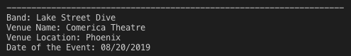
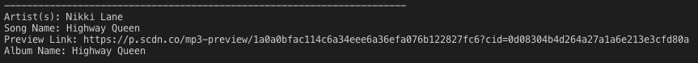
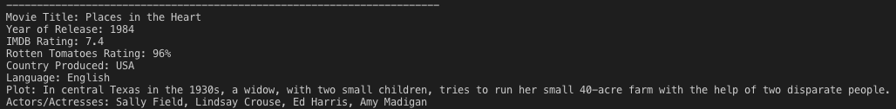

# **Liri - Node.JS**

## LIRI is like iPhone's SIRI. However, while SIRI is a Speech Interpretation and Recognition Interface, LIRI is a Language Interpretation and Recognition Interface. LIRI will be a command line node app that takes in parameters and gives you back data.

### Setup :house:

- Clone the repository
- [Node](https://nodejs.org/en/) - Node.JS
- Run npm install
  **Install the following packages:**
- [node-spotify-api](https://www.npmjs.com/package/node-spotify-api) - Node-Spotify-API
- [Axios](https://www.npmjs.com/package/axios) - Axios - You'll use Axios to grab data from the OMDB API and the Bands In Town API
- [Moment](https://momentjs.com/) - Moment
- [dotenv](https://www.npmjs.com/package/dotenv) - DotEnv
- [file-system](https://www.npmjs.com/package/file-system) - File-System

### Environment :earth_americas:

- Create a .env file using the provided sample file.

### Liri can take in one of the following commands:

- concert-this :guitar:
- spotify-this-song :notes:
- movie-this :movie_camera:
- do-what-it-says :game_die:

### What Each Command Should Do

1. **node liri.js concert-this 'artist/band name here'**

   This will search the Bands in Town Artist Events API for an artist and render the following information about each event to the terminal:

- Name of the venue
- Venue location
- Date of the Event

2. **node liri.js spotify-this-song 'song name here'**

   This will show the following information about the song in your terminal/bash window

- Artist(s)
- The song's name
- A preview link of the song from Spotify
- The album that the song is from

3. **node liri.js movie-this 'movie name here'**

   This will output the following information to your terminal/bash window:

- Title of the movie.
- Year the movie came out.
- IMDB Rating of the movie.
- Rotten Tomatoes Rating of the movie.
- Country where the movie was produced.
- Language of the movie.
- Plot of the movie.
- Actors in the movie.

4. **node liri.js do-what-it-says**

   Using the fs Node package, LIRI will take the text inside of random.txt and then use it to call one of LIRI's commands.

### **BONUS**

In addition to logging the data to the terminal/bash window, the data will be output to a .txt file:

- concert-this.txt
- spotify-this-song.txt
- movie-this.txt
